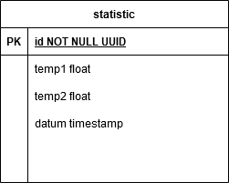

# Test Datenbank für Postgres

Für den Docker Container wird das aktuelle Postgres Image postgres:13 genutzt.
Über die Environment Variablen der docker-compose werden die User Credentials gesetzt sowie der Name der Datenbank.

```
      POSTGRES_USER: dev
      POSTGRES_PASSWORD: dev
      POSTGRES_DB: test_data
```

## Starten und Initialisieren der Datenbank

### Erstellen und Starten 

```
docker-compose up
```

### Löschen

```
docker rm testdb
```

### Initialisieren

Die Tabellen werden beim ersten `docker-compose up` durch die Skripte in `docker-entrypoint-initdb.d` aufgesetzt und initialisiert. 
Die Daten wurden mit https://www.generatedata.com/ generiert und als SQL Insert Statements exportiert.

ACHTUNG: Sollten Änderungen an den Initialisierungsskripten gemacht werden, so muss der Container erst gelöscht werden, damit diese bei einem erneuten ausführen von `docker-compose up` ausgeführt werden.

### Aktuell enthaltene Tabellen




