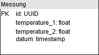

# Test Datenbank für Postgres

Für den Docker Container wird das Postgres Image [postgres:12.1](https://hub.docker.com/_/postgres) genutzt.
Über die Environment Variablen der docker-compose werden die User Credentials gesetzt sowie der Name der Datenbank (test_data).

```
      POSTGRES_USER: dev
      POSTGRES_PASSWORD: dev
      POSTGRES_DB: test_data
```

## Starten und Initialisieren der Datenbank

### Erstellen und Starten 

```
docker-compose up
```

### Löschen

```
docker rm testdb
```

### Adminer

In der docker-compose ist zusätzlich das Tool [Adminer](https://hub.docker.com/_/adminer) enthalten.
Dies ist ein leichtgewichtiges Tool zum visualisieren der Datenbank.
Soll dies benutzt werden, so muss die entsprechende Sektion in der docker-compose einkommentiert werden.
Danach ist Adminer unter `localhost:7000` über einen beliebigen Browser zu erreichen.
Die Datenbank muss innerhalb von Docker Containern mit dem Container-Namen `testdb` angesprochen werden.
Der DNS vom Dockerdeamon löst diesen Namen anschließend auf.


### Initialisieren

Die Tabellen werden beim ersten `docker-compose up` durch die Skripte in `docker-entrypoint-initdb.d` aufgesetzt und initialisiert. 
Die Daten wurden mit https://www.generatedata.com/ generiert und als SQL Insert Statements exportiert.

ACHTUNG: Sollten Änderungen an den Initialisierungsskripten gemacht werden, so muss der Container erst gelöscht werden, damit diese bei einem erneuten ausführen von `docker-compose up` ausgeführt werden.

### Aktuell enthaltene Tabellen




